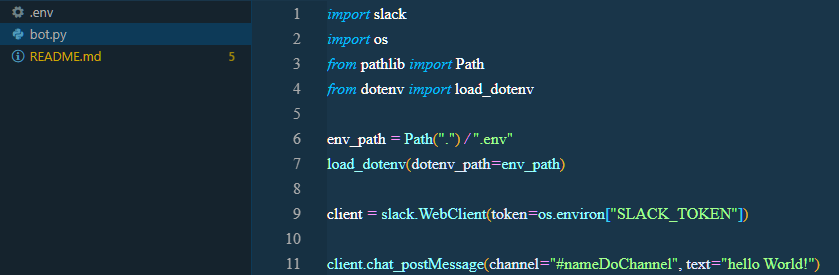
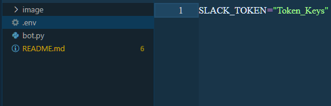
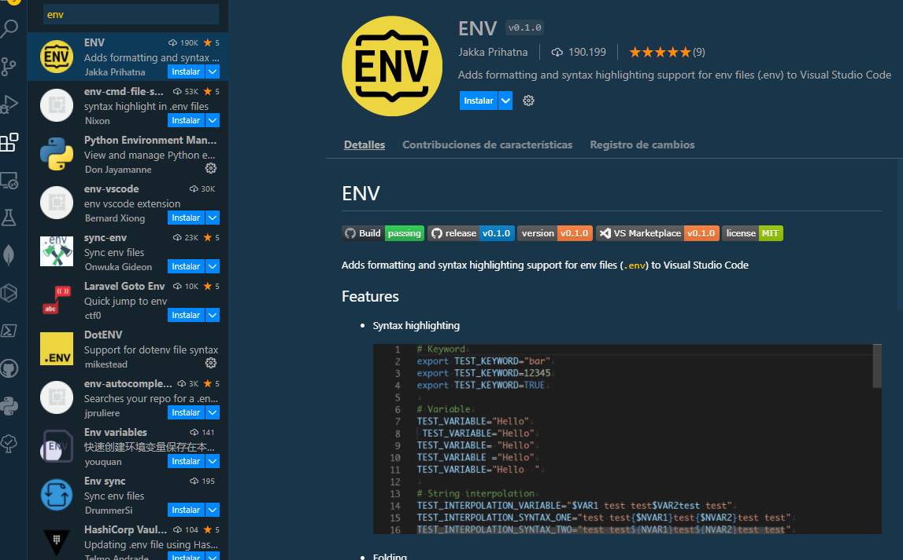

# Starting to create bot integration with python.

## install first  library

pip install slackclient

[pip python-dotenv](https://pypi.org/project/python-dotenv/)

First part of the code

The code show gives us a simple message of hello world

**create a file extension .py**

**create a file extencion .env**

### Import , Install extencion for the Marketplace

# Two part of the code

pip install flask

pip install slackeventsapi

pip install Jinja2
pip install MarkupSafe
pip install MarkupSafe

https://ngrok.com/download

[ngrok-stable-windows-amd64.zip](https://github.com/Estebanjgg/EstebanBotOne/files/8423536/ngrok-stable-windows-amd64.zip)
